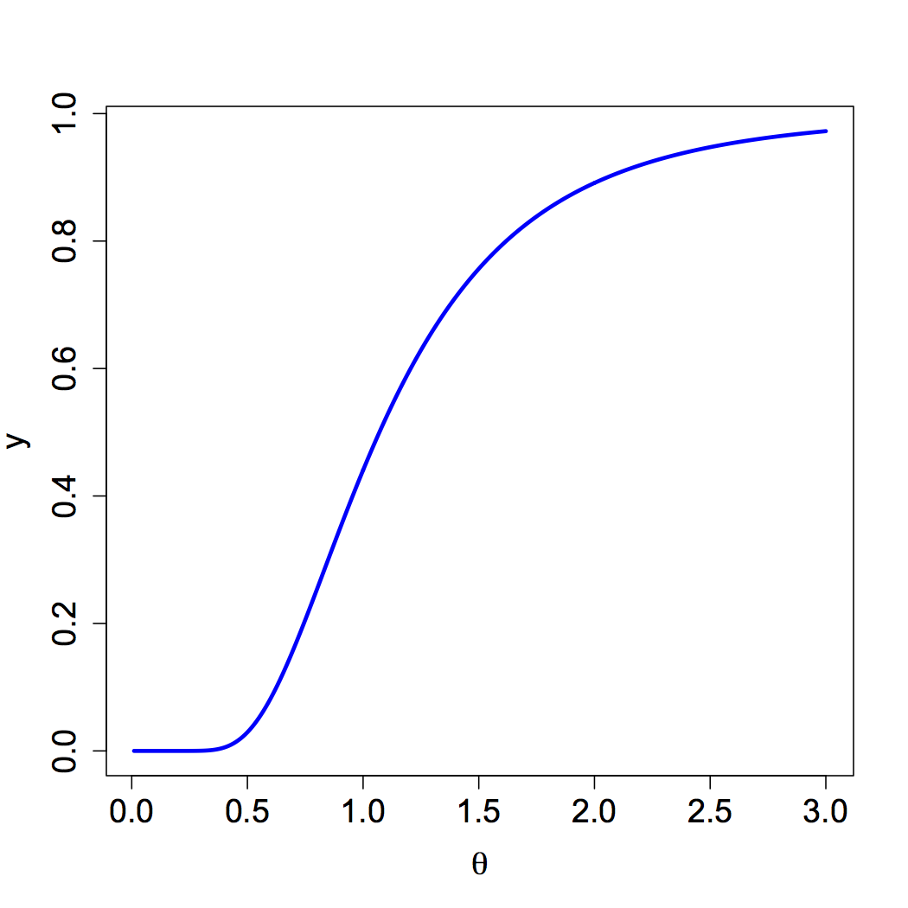

[](http://quantlet.de/)

## [](http://quantlet.de/) **MSEEX0810** [](http://quantlet.de/)

```yaml

Name of QuantLet : MSEEX0810

Published in : 'Modern Mathematical Statistics: Exercises and Solutions'

Description : 'Illustrates the proof of increasing monotonicity of a probability function on
positive real numbers for a volatility model with natural parameter theta.'

Keywords : parameter, chi-sqaure, variance, model, plot

Author : Wolfgang Karl Haerdle, Vladimir Panov, Vladimir Spokoiny, Weining Wang

Submitted : Tue, June 21 2011 by Maria Osipenko

Example : 'Shows increasing monotonicity of the function g(theta) = 1 - G_10(10/theta), with G_10
the cdf of a chi-square distribution with 10 degrees of freedom evaluated on an interval of theta
=[0.01, 3].'

```




### R Code:
```r
# Close windows and clear variables
graphics.off()
rm(list = ls(all = T))

theta = seq(0.01, 3, 0.01)  # area to evaluate the pdf
y = 1 - pchisq(10/theta, df = 10)  # cdf
plot(theta, y, xlab = expression(paste("", theta)), "l", col = "blue", cex.lab = 1.5, cex.axis = 1.5, lwd = 3) 

```
