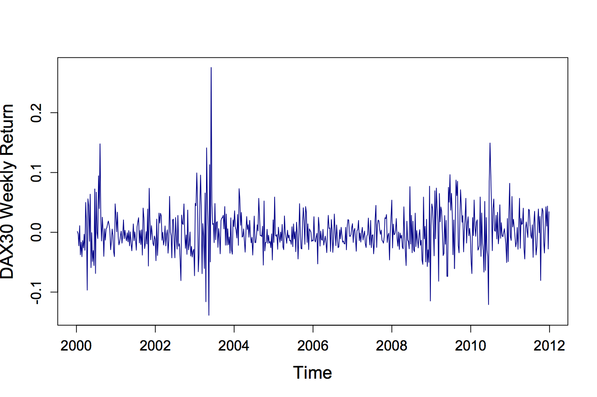

[](http://quantlet.de/index.php?p=info)

## [](http://quantlet.de/) **MSEDAXre** [](http://quantlet.de/d3/ia)

```yaml

Name of QuantLet : MSEDAXre

Published in : 'Modern Mathematical Statistics: Exercise and Solution'

Description : 'Plots the DAX returns from 2000 to 2011 and performs an F-test for variance
comparison of specific time periods. From the plot a period of higher volatility is followed by a
period of lower volatility and again followed by a period of higher volatility. To proof this
finding, the time series is split into 3 intervals, each of which is tested against the other for
variance comparison. The variances of the first and the third period differ significantly from the
second period.'

Keywords : plot, returns, dax, variance, test, testing, f-test, normality test

Author : Wolfgang Karl Haerdle, Vladimir Panov, Vladimir Spokoiny, Weining Wang

Submitted : Tue, November 13 2012 by Dedy Dwi Prastyo

Example : 'Plots the DAX returns from 2000 to 2011 and performs an F-test for variance comparison
of specific time periods.'

```




### R Code:
```r
# clear history
rm(list = ls(all = TRUE))
graphics.off()

# install/load packages
libraries = c("foreign", "stats")
lapply(libraries, function(x) if (!(x %in% installed.packages())) {
    install.packages(x)
})
lapply(libraries, library, quietly = TRUE, character.only = TRUE)

DAXall = read.csv("DAX20000101-20111231.csv")
time = seq(from = as.Date("2000-01-03"), to = as.Date("2011-12-27"), length.out = 626)
DAX = DAXall[1:626, 8]

plot(DAX ~ time, xlab = "Time", ylab = "DAX30 Weekly Return", type = "l", pch = 20, cex = 1, cex.axis = 1.2, cex.lab = 1.5, 
    lab = c(3, 3, 0), main = "", col = "blue4")

DAX1 = DAXall[2:209, 8]
DAX2 = DAXall[210:417, 8]
DAX3 = DAXall[418:626, 8]

var.test(DAX1, DAX2)
var.test(DAX2, DAX3)
var.test(DAX1, DAX3) 

```
