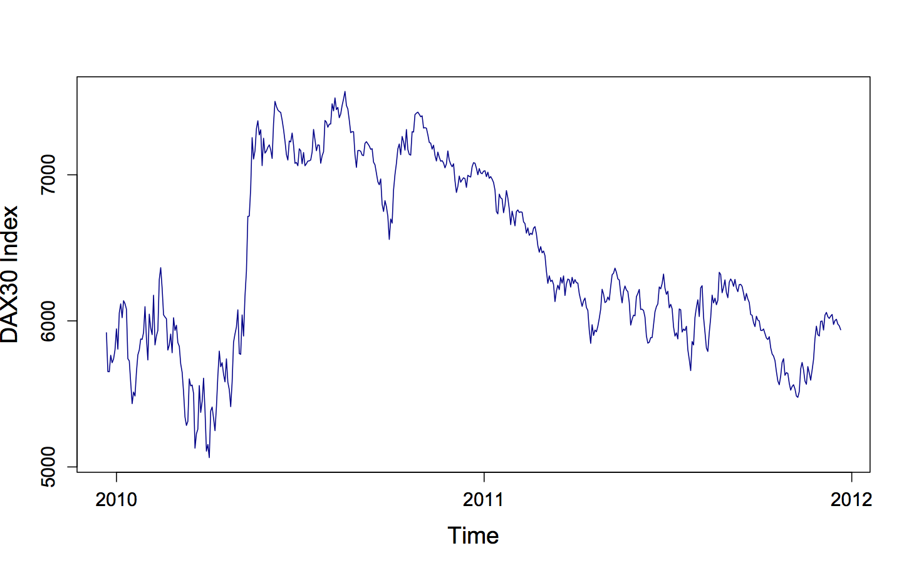

[](http://quantlet.de/)

## [](http://quantlet.de/) **MSENormalityTests** [](http://quantlet.de/)

```yaml

Name of QuantLet : MSENormalityTests

Published in : 'Modern Mathematical Statistics: Exercise and Solution'

Description : Plots the time series of the DAX30 index from 2009-12-21 to 2011-12-22

Keywords : plot, time-series, dax, index, visualization

Author : Wolfgang Karl Haerdle, Vladimir Panov, Vladimir Spokoiny, Weining Wang

Submitted : Tue, November 13 2012 by Dedy Dwi Prastyo

Example : Plots the time series of the DAX from 2009-12-21 to 2011-12-22

```




### R Code:
```r
# Close windows and clear variables
rm(list = ls(all = TRUE))
graphics.off()

# install/load packages
libraries = c("foreign")
lapply(libraries, function(x) if (!(x %in% installed.packages())) {
    install.packages(x)
})
lapply(libraries, library, quietly = TRUE, character.only = TRUE)

das = read.csv("data_DAX091222-111222.csv")
das = das[, 2]  # use DAX series
d = seq(from = as.Date("2009-12-22"), to = as.Date("2011-12-21"), length.out = 515)

plot(das ~ d, xlab = "Time", ylab = "DAX30 Index", pch = 20, cex = 1, cex.axis = 1.2, cex.lab = 1.5, lab = c(3, 3, 0), main = "", 
    col = "blue4", type = "l") 

```
