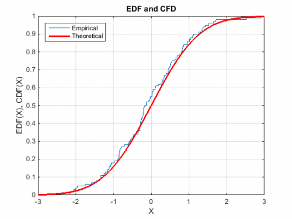
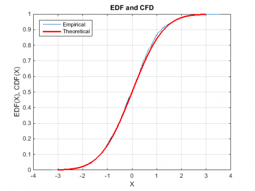

[](http://quantlet.de/index.php?p=info)

## [](http://quantlet.de/) **MSEedfnormal** [](http://quantlet.de/d3/ia)

```yaml

Name of QuantLet : MSEedfnormal

Published in : 'Modern Mathematical Statistics : Exercises and Solutions'

Description : 'Draws n observations from a standard normal distribution and plots its empirical
distribution function (edf) vs. the normal cumulative distribution function (cdf). Number of draws
can be entered interactively.'

Keywords : approximation, cdf, distribution, edf, empirical, normal-distribution, standard-normal

Author : Wolfgang K. Haerdle, Lukas Borke

Submitted : Wed, March 04 2015 by Lukas Borke

Input : 'n: number of observations'

Output : 'Draws n observations from a standard normal distribution and plots its empirical
distribution function (edf) vs. the normal cumulative distribution function (cdf).'

Example : One plot with n=100 and one with n=1000.

```






### MATLAB Code:
```matlab
close all
clear
clc

disp('Please input number of draws n as') ;
disp(' ') ;
n = input('[n]=');

y = normrnd(0,1,n,1); %Generate standard normal random numbers
cdfplot(y)            %Plot the empirical distribution function

hold on

x = -3:0.1:3;
f = normcdf(x,0,1);   %Generate normal cumulative distribution function

plot(x,f,'r','LineWidth',2.5)
legend('Empirical','Theoretical','Location','NW')
title('EDF and CFD')
xlabel('X')
ylabel('EDF(X), CDF(X)')

hold off

```
