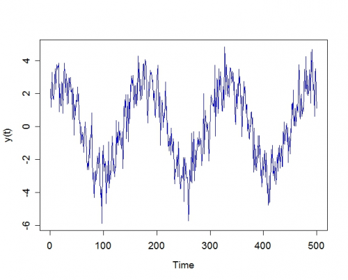

[](http://quantlet.de/index.php?p=info)

## [](http://quantlet.de/) **MSEex0706** [](http://quantlet.de/d3/ia)

```yaml

Name of QuantLet : MSEex0706

Published in : 'Modern Mathematical Statistics : Exercises and Solutions'

Description : Plots and illustrates the spectral model and the linear model in this exercise.

Keywords : estimation, spectral, linear, model, linear-model, plot, visualization

Author : Wolfgang Karl Haerdle, Vladimir Panov, Vladimir Spokoiny, Weining Wang

Submitted : Tue, November 13 2012 by Dedy Dwi Prastyo

Example : Shows the model over time

```




### R Code:
```r
A <- 2
B <- 0.5
sigma <- 0.8  # variance of the 
y <- numeric(0)

for (t in 1:500) {
    y[t] <- A * cos((0.04) * t) + A * sin((0.04) * t) + B * cos((0.5) * t) + B * sin((0.5) * t) + rnorm(1, sd = sigma)
}

T <- c(1:500)
plot(T, y, xlab = "Time", ylab = "y(t)", type = "l", col = "blue3", cex.lab = 1.2, cex.axis = 1.2) 

```
