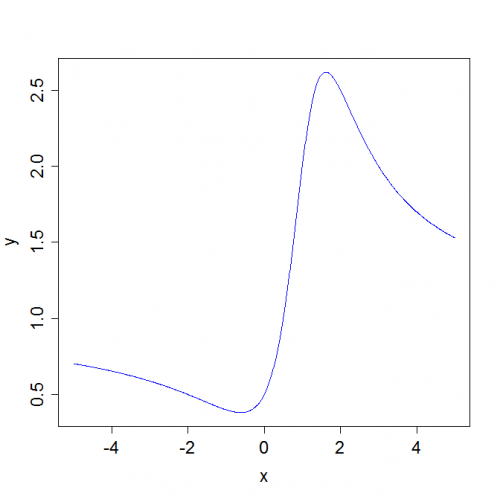

[](http://quantlet.de/index.php?p=info)

## [](http://quantlet.de/) **MSEfcauchy** [](http://quantlet.de/d3/ia)

```yaml

Name of QuantLet : MSEfcauchy

Published in : 'Modern Mathematical Statistics: Exercises and Solutions'

Description : 'Plots the critical region of the Neyman-Pearson test within a specific interval if p
is a density of the standard Cauchy distribution.'

Keywords : plot, Cauchy distribution, distribution, function, visualization

Author : Wolfgang K. Haerdle, Weining Wang, Shih Kang Chao

Submitted : Mon, September 27 2010 by Maria Osipenko

Example : Plots y = f(x) where x1 and x2 (x1 < x2) are two solutions of the quadratic equation.

```




### R Code:
```r
x = seq(-5, 5, 0.01)
y = (1 + x^2)/(1 + ((x - 1)^2))
plot(x, y, "l", col = "blue", cex.lab = 1.5, cex.axis = 1.5) 

```
