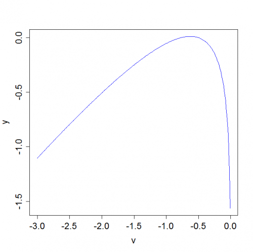

[](http://quantlet.de/index.php?p=info)

## [](http://quantlet.de/) **MSEklcanparam** [](http://quantlet.de/d3/ia)

```yaml

Name of QuantLet : MSEklcanparam

Published in : 'Modern Mathematical Statistics: Exercises and Solutions'

Description : Draws a plot of the Kullback-Leibler function for a canonical parameter.

Keywords : plot, Kullback-Leibler, function, canonical-parameter, parameter

Author : Wolfgang K. Haerdle, Weining Wang, Shih Kang Chao

Submitted : Mon, September 27 2010 by Maria Osipenko

Example : Plot of the Kullback-Leibler function f(theta) for a canonical parameter.

```




### R Code:
```r
v = seq(-3, -0.01, 0.01)
y = 0.8 * v - 0.5 * log(-0.5/v) + 0.4
plot(v, y, "l", col = "blue", cex.lab = 1.5, cex.axis = 1.5) 

```
