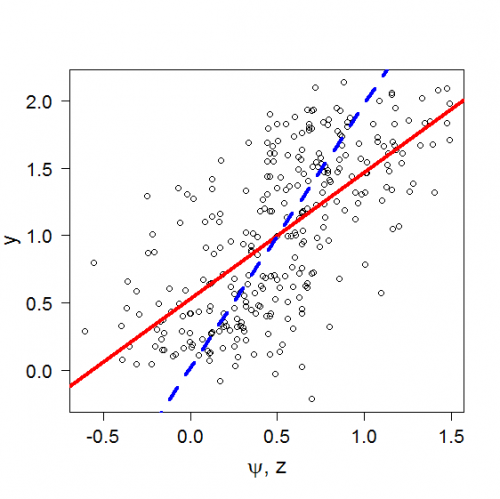

[](http://quantlet.de/index.php?p=info)

## [](http://quantlet.de/) **MSEregression** [](http://quantlet.de/d3/ia)

```yaml

Name of QuantLet : MSEregression

Published in : 'Modern Mathematical Statistics: Exercises and Solutions'

Description : 'Generates n = 300 samples, then performs linear regressions in the error in design
model.'

Keywords : plot, regression, linear-regression, error, model

Author : Weining Wang, Lining Yu

Submitted : Fri, November 09 2012 by Dedy Dwi Prastyo

Example : 'The linear regression line of Yi and Zi (solid line) and the linear regression line of
Yi on Phii (dashed line), for n=300.'

```




### R Code:
```r
sum_b = 0

for (iter in 1:400) {
    n = 300
    x = runif(n, 0, 1)
    e = rnorm(n, 0, 0.1)
    u = rnorm(n, 0, 0.3)
    z = x + u
    y = 2 * x + e
    
    lm.y = lm(y ~ x)
    summary(lm.y)
    
    lm.z = lm(y ~ z)
    summary(lm.z)
    
    plot(z, y, cex.axis = 1.2, font.axis = 1, cex.lab = 1.5, las = 1, xlab = c(expression(paste(psi, ", z"))), ylab = "y")
    abline(lm.z, lwd = 4, lty = 1, col = "red")
    abline(lm.y, lwd = 4, lty = 2, col = "blue")
    b = summary(lm.z)$coef[2]
    sum_b = (sum_b + b)
}

1/400 * sum_b 

```
