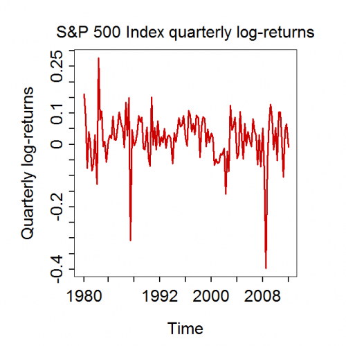

[](http://quantlet.de/index.php?p=info)

## [](http://quantlet.de/) **MSEspqlogret** [](http://quantlet.de/d3/ia)

```yaml

Name of QuantLet : MSEspqlogret

Published in : 'Modern Mathematical Statistics: Exercises and Solutions'

Description : Plots quarterly S&P 500 index log-returns for data from Q2 1980 to Q2 2012.

Keywords : plot, data visualization, time-series, financial, log-returns

Author : Wolfgang Karl Haerdle, Vladimir Panov, Vladimir Spokoiny, Weining Wang

Submitted : Thu, November 15 2012 by Dedy Dwi Prastyo

Datafile : spq.txt

Example : Plot of S&P 500 index quartlery log-returns during the period Q2 1980 - Q2 2012.

```




### R Code:
```r
# install.packages('boot') install.packages('pastecs') install.packages('graphics')


library(boot)
library(pastecs)
library(graphics)

file = "spq"

datafile = paste(file, "txt", sep = ".")

quarterly = read.table(datafile, sep = "", dec = ",")
colnms = c("date", "year", "price")

colnames(quarterly) = colnms
attach(quarterly)

return = diff(log(price))
n = length(diff(log(price)))

par(mai = c(1.4, 1.5, 1, 1))
plot(return, col = "red3", type = "l", xlim = c(0, n), ylim = c(min(return), max(return)), axes = FALSE, frame = TRUE, lwd = 3, 
    cex.main = 2.8, ann = FALSE)
mtext(side = 3, text = "S&P 500 Index quarterly log-returns", line = 1, cex = 2)
mtext(side = 1, text = "Time", line = 5, cex = 2)
mtext(side = 2, text = "Quarterly log-returns", line = 4, cex = 2)
axis(side = 2, at = seq(-0.4, 0.3, by = 0.05), label = seq(-0.4, 0.3, by = 0.05), lwd = 1.2, cex.axis = 2, lwd.ticks = 2)
axis(side = 1, at = c(1, 16, 32, 48, 64, 80, 96, 112, 128), label = c("1980", "1984", "1988", "1992", "1996", "2000", "2004", 
    "2008", "2012"), lwd = 1, cex.axis = 2, padj = 0.55, lwd.ticks = 2) 

```
