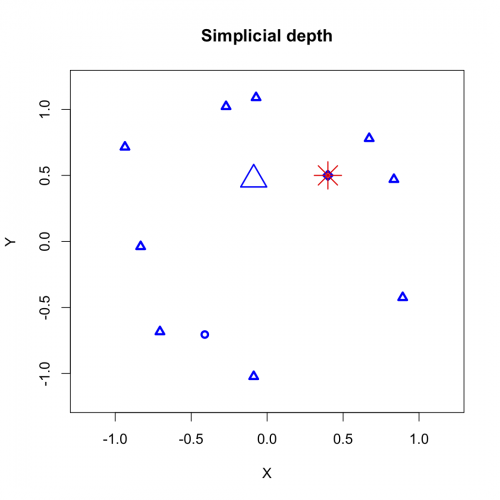

[](http://quantlet.de/index.php?p=info)

## [](http://quantlet.de/) **SMSsimpdsimu** [](http://quantlet.de/d3/ia)

```yaml

Name oF QuantLet : SMSsimpdsimu

Published in : 'Modern Mathematical Statistics : Exercises and Solutions'

Description : Calculates and plots the simplicial depth of a simulated data set.

Keywords : simplicial-depth, plot, visualization, simulation, estimation

See also : SMSdisfbank2, SMSsimpdbank, SMSsvmorange

Author : Wolfgang Karl Haerdle, Vladimir Panov, Vladimir Spokoiny, Weining Wang

Submitted : Tue, March 12 2013 by Maria Osipenko

Example : Plot of the simplicial depth in the simulated data set

```




### R Code:
```r
rm(list=ls(all=TRUE))
graphics.off()

#load packages
install.packages("depth")
install.packages("localdepth")
install.packages("MASS")

library(depth)
library(localdepth)
library(MASS)

# simulate data
set.seed(2007)
n = 10
a = runif(n,0,1)*pi*2
x = cbind(cos(a),sin(a))
x = x + 0.1*mvrnorm(n,c(0,0),Sigma=matrix(c(1,0,0,1),2,2))
x = rbind(x,c(0.4,0.5))


# estimate the location by simdep

m   = med(x,method="Liu")
mm  = m$median #the two-dimensional median

#computes the size of the simplices formed from x and returns the corresponding quantiles
tau = quantile.localdepth(x,probs=0.1,size=TRUE,use="volume")
#computes the depth and the local depth for the set of points of x
ld  = localdepth(x,tau=tau$quantile,method="simplicial",use="volume")
dep = ld$depth #vector of the depth values


med12 = apply(x,2,median)

dep = 165*apply(x,1,depth,x,"Liu")
col = round(4*dep/max(dep))
par(c(1,1),cex=1.2)
#1 is a circle, 2 is a triangle, 3 is a cross, 4 is a X-symbol, 5 is a rhombus, 6 is an inverted triangle, 15 is a filled rectangle, 16 is a filled circle, 17 is a filled triangle, 18 is a filled rectangle 
col=4*(col==1)+2*(col==2)+1*(col==3)+5*(col==4)+6*(col==5)+3*(col==6)+15*(col==7)+16*(col==8)+17*(col==9)+18*(col==10)
      
plot(x,pch=col,col="blue",xlab="X",ylab="Y",main="Simplicial depth",xlim=c(-1.2,1.2),ylim=c(-1.2,1.2),lwd=3)
#median is the big red star
points(mm[1],mm[2],col="red",pch=8,cex=3,lwd=1.5)
points(med12[1],med12[2],col="blue",pch=2,cex=3,lwd=2)

dep


```
